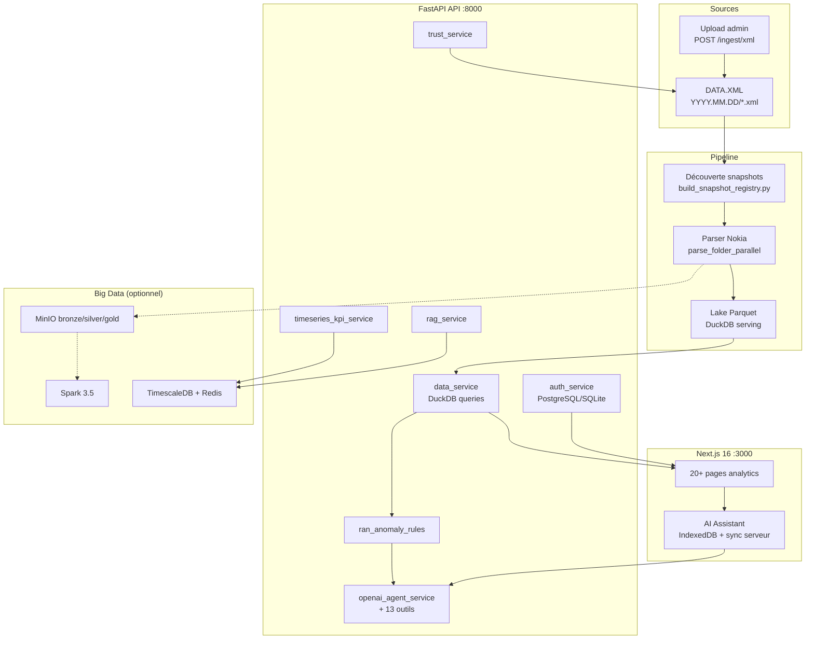
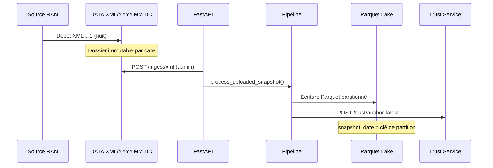

#  RAN Intelligence

**Plateforme de décision NOC** pour l'analyse quotidienne des snapshots RAN (Nokia, Huawei en préparation) — conçue pour les équipes NOC / Radio d'Ooredoo Tunisie.

> **RAN Intelligence n'est pas une IA qui parle sur des données réseau. C'est une plateforme où l'IA est placée après la validation, l'analyse, l'anomalie et la prédiction.**

> 4 moteurs : Data Integrity · Change Intelligence · Anomaly Intelligence · Predictive Risk · **Guardian Copilot**

---

## Table des matières

- [Vision](#vision)
- [Fonctionnalités](#fonctionnalités)
- [Architecture](#architecture)
- [Stack technique](#stack-technique)
- [Modèle de données](#modèle-de-données)
- [Modules frontend](#modules-frontend)
- [API REST](#api-rest)
- [Assistant IA](#assistant-ia)
- [Authentification & rôles](#authentification--rôles)
- [Workflows opérationnels](#workflows-opérationnels)
- [Structure du projet](#structure-du-projet)
- [Prérequis](#prérequis)
- [Installation locale](#installation-locale)
- [Configuration](#configuration)
- [Docker & Big Data](#docker--big-data)
- [Scripts utilitaires](#scripts-utilitaires)
- [CI/CD](#cicd)
- [Roadmap & limites connues](#roadmap--limites-connues)
- [Documentation complémentaire](#documentation-complémentaire)

---

## Vision

RAN Intelligence transforme les exports XML quotidiens des BTS (Nokia aujourd'hui, Huawei en préparation) en une **couche analytique exploitable** par les ingénieurs radio :

1. **Ingérer** les snapshots XML datés (`YYYY.MM.DD`) depuis un répertoire central.
2. **Parser & normaliser** en tables Parquet (sites, équipements, compteurs, complétude).
3. **Servir** via une API FastAPI + DuckDB pour des dashboards temps réel.
4. **Détecter** anomalies, remplacements et risques avant toute explication IA.
5. **Expliquer** via un assistant conversationnel (OpenAI + outils backend contrôlés).
6. **Ancrer** l'intégrité des données (hash chaîné par snapshot).

L'objectif n'est pas un simple tableau de bord : c'est **Guardian Nexus AI** — observer → détecter → prédire → expliquer → recommander (human-in-the-loop).

---

## Fonctionnalités

| Domaine | Capacités |
|---------|-----------|
| **Pilotage** | Dashboard exécutif, sites, inventaire, distribution assets, qualité, console ops |
| **Évolution** | Delta inter-snapshots, remplacements estimés, statistiques, prédiction, suivi spares |
| **Analytique** | Analytics avancées, changements temporels, compteurs globaux |
| **IA & Risques** | Anomalies, cartes risque, patterns serial, clustering, rapport IA, assistant ChatGPT-like |
| **Data Trust** | Hash SHA-256 par fichier XML, chaînage par date, vérification d'intégrité |
| **Multi-vendor** | Nokia (production), Huawei (scaffold prêt) |
| **Auth** | JWT, OTP email/SMS, clés d'accès, rôles admin/responsable, audit activité |
| **i18n** | Interface Français / English |

---

## Architecture



### Principes d'architecture

- **Medallion** : Bronze (XML brut + registre) → Silver (Parquet normalisé) → Gold (agrégats serving).
- **Séparation IA / données** : le LLM n'accède **jamais** directement au lake ; il appelle des **outils FastAPI** contrôlés (`ran_ai_tools.py`).
- **Règles avant IA** : le moteur `ran_anomaly_rules` détecte les signaux ; l'IA explique et recommande.
- **Contrat API stable** : le frontend consomme des endpoints POST filtrés ; migration big-data sans refonte UI.

---

## Stack technique

### Backend

| Technologie | Rôle |
|-------------|------|
| **Python 3.12** | Runtime principal |
| **FastAPI 0.122** | API REST, upload, auth middleware |
| **Uvicorn** | Serveur ASGI |
| **DuckDB 1.5** | Moteur analytique sur Parquet |
| **Pandas / PyArrow** | Transformations & export |
| **lxml** | Parsing XML Nokia |
| **PyJWT + passlib** | Authentification JWT / bcrypt |
| **psycopg 3** | PostgreSQL (auth, spares, knowledge) |
| **PySpark 4.1** | Jobs batch (migration big-data) |
| **Streamlit 1.58** | UI legacy (`app/`) — conservée en parallèle |

### Frontend

| Technologie | Rôle |
|-------------|------|
| **Next.js 16** | App Router, SSR/CSR |
| **React 19** | Composants UI |
| **TypeScript 5** | Typage strict |
| **Tailwind CSS 4** | Design system blanc/rouge Ooredoo |
| **Recharts 3** | Graphiques KPI, analytics |
| **IndexedDB** | Historique conversations IA offline |

### Infrastructure

| Technologie | Rôle |
|-------------|------|
| **Docker Compose** | API + frontend, auth PG, big-data stack |
| **TimescaleDB** | KPI time-series (CSSR, DCR, PRB…) |
| **MinIO** | Object storage S3-compatible |
| **Spark 3.5** | Transformations distribuées |
| **Redis 7** | Cache (prévu) |
| **GitHub Actions** | CI compile + lint + build |

### IA (hybride)

| Provider | Usage |
|----------|-------|
| **OpenAI GPT-4o** | Chat, RCA, rapports NOC, function calling (13 outils) |
| **Claude Sonnet** | Documents techniques longs (>3500 chars) |
| **Moteur local** | Salutations, suivi contextuel, fallback sans clé API |
| **RAG keyword** | Procédures Nokia/Huawei seedées (pgvector prévu) |

---

## Modèle de données

### Entrée — Snapshots XML

```
C:\projects\DATA.XML\
├── 2025.09.11\
│   ├── MRBTS515401.xml
│   ├── MRBTS515348.xml
│   └── ... (1 fichier ≈ 1 site)
├── 2026.05.14\
│   └── ...
└── 2026.06.07\
    └── ...
```

Convention de nommage : `YYYY.MM.DD` ou `YYYY-MM-DD` (normalisé en interne).

### Lake Parquet (`data/lake/`)

| Dataset | Contenu |
|---------|---------|
| `sites/` | Identité site, techno, SW, snapshot_date |
| `equipment/` | Cartes RMOD, BBMOD, serials, object_type |
| `counters/` | Compteurs équipement par classe |
| `completeness/` | Scores qualité, champs manquants |
| `site_changes/` | Historique modifications inter-snapshots |
| `delta/` | Métriques delta pré-calculées |

### Bronze (`data/bronze/`)

- `snapshot_registry.csv` — registre des dossiers découverts, statut `DISCOVERED` / `PROCESSED`.

### Bases métier (hors repo — `.gitignore`)

| Base | Contenu |
|------|---------|
| `data/auth/` | Utilisateurs, sessions, OTP, activité |
| `data/trust/` | Ancres hash chaînées par snapshot |
| `data/knowledge/` | Procédures RAG, embeddings |

---

## Modules frontend

Navigation organisée en 4 sections (`frontend/lib/nav.ts`) :

### Pilotage
| Route | Description |
|-------|-------------|
| `/` | Dashboard exécutif — KPIs consolidés |
| `/sites` | Exploration sites + bouton **Analyser avec IA** + graphiques KPI |
| `/inventaire` | Inventaire équipements filtrable |
| `/asset-distribution` | Distribution par type d'asset |
| `/quality` | Scores qualité, complétude, alertes |
| `/ops` | Console ops (admin) — métriques requêtes, trust anchors |

### Évolution
| Route | Description |
|-------|-------------|
| `/delta` | Comparaison inter-snapshots unifiée |
| `/remplacements` | Analytics remplacements de cartes |
| `/statistiques` | Statistiques réseau |
| `/prediction` | Prédiction tendances |
| `/spares` | Suivi pièces de rechange (PostgreSQL) |

### Analytique
| Route | Description |
|-------|-------------|
| `/analytics` | Analytics avancées multi-dimensions |
| `/temporal-changes` | Changements dans le temps (admin) |
| `/global-counters` | Compteurs globaux agrégés (admin) |

### IA & Risques
| Route | Description |
|-------|-------------|
| `/anomalies` | Alertes moteur de règles |
| `/cartes-risque` | Cartes risque par site/type |
| `/patterns` | Mining préfixes serial IA |
| `/clustering` | Clustering sites/équipements (admin) |
| `/ai-report` | Rapport IA généré (admin) |
| `/ai-assistant` | Assistant conversationnel premium |

### Auth
| Route | Description |
|-------|-------------|
| `/login` | Connexion 2FA (email + téléphone) |
| `/signup` | Inscription avec clé d'accès |
| `/activate` | Activation compte |
| `/admin/users` | Gestion utilisateurs (admin) |

---

## API REST

Base URL locale : `http://127.0.0.1:8010` (ou `8000` en Docker).

### Santé & readiness

```
GET  /health          → {"status": "ok"}
GET  /ready           → {"ready": true|false}  (lake Parquet disponible)
```

### Ingestion & snapshots (admin)

```
POST /ingest/xml              Upload XML + traitement pipeline
POST /snapshots/delete        Suppression snapshots + lake associé
```

### Analytics core (auth requis)

```
POST /filters/options         Options filtres (dates, sites, vendors)
POST /dashboard               KPIs dashboard
POST /sites                   Liste sites
POST /v2/sites                Sites enrichis v2
POST /inventory               Inventaire paginé
POST /v2/inventory            Inventaire v2
POST /delta                   Métriques delta
POST /delta/compare           Comparaison deux snapshots
POST /statistics              Statistiques
POST /prediction              Prédiction
POST /analytics               Analytics
POST /temporal-changes        Changements temporels
POST /asset-distribution      Distribution assets
POST /v2/asset-distribution   Distribution v2
POST /v2/asset-product-codes  Codes produit
POST /global-counters         Compteurs globaux
POST /quality                 Rapport qualité
```

### Investigation

```
POST /investigate/site        Investigation site
POST /investigate/serial      Investigation serial
POST /investigate/snapshot    Investigation snapshot
POST /investigate/object-type Investigation par type
POST /investigate/patterns    Patterns serial
POST /investigate/site/ai-rca RCA IA guidée par règles
```

### Modules métier

```
POST /replacements            Analytics remplacements
POST /risk-cards              Cartes risque
POST /spares                  Spares legacy
POST /spares/tracking         Suivi spares PostgreSQL
POST /anomalies               Anomalies règles métier
POST /ai-report               Rapport IA
POST /clustering              Clustering
GET  /vendors                 Statut vendors (nokia/huawei)
```

### KPI & RAG

```
POST /kpi/site-timeseries     Série temporelle KPI site (CSSR, DCR, PRB…)
POST /kpi/ingest              Ingestion KPI
POST /kpi/critical-sites      Sites critiques KPI
POST /rag/search              Recherche procédures
POST /rag/ingest              Ingestion document RAG
POST /rag/seed                Seed procédures Nokia/Huawei
```

### Assistant IA

```
GET  /assistant/status                    Statut moteurs IA
POST /assistant                           Assistant règles (local)
POST /assistant/insight                   Insight contextuel
POST /assistant/insight-with-files        Insight + fichiers joints
GET  /assistant/conversations             Liste conversations
POST /assistant/conversations             Créer conversation
GET  /assistant/conversations/{id}        Détail + messages
PUT  /assistant/conversations/{id}        Renommer
DELETE /assistant/conversations/{id}      Supprimer
PATCH /assistant/conversations/{id}/pin   Épingler / désépingler
```

### Ops & Trust

```
POST /ops/summary             Résumé opérationnel
GET  /ops/query-metrics       Latence requêtes (avg, p95, max)
GET  /trust/anchors           Liste ancres
POST /trust/anchor            Ancrer snapshot
POST /trust/anchor-latest     Ancrer dernier snapshot
POST /trust/verify            Vérifier intégrité chaîne
```

### Auth (`/auth/*`)

```
GET  /auth/job-profiles
POST /auth/signup
POST /auth/login/step1 | step2
POST /auth/admin/login/step1 | step2
POST /auth/refresh
GET  /auth/me
POST /auth/users/create       (admin)
GET  /auth/activity           (admin)
GET  /auth/database/status
```

---

## Assistant IA

### Architecture hybride

```
Utilisateur
    ↓
AI Assistant UI (voix, fichiers, historique)
    ↓
POST /assistant/insight  ou  OpenAI Agent
    ↓
┌─────────────────────────────────────┐
│  OpenAI GPT-4o (function calling)   │
│  13 outils ran_ai_tools.py :        │
│  · get_network_summary              │
│  · get_site_status                  │
│  · get_quality_overview             │
│  · get_anomaly_alerts               │
│  · get_delta_analysis               │
│  · get_replacements_top             │
│  · get_risk_cards                   │
│  · get_serial_patterns              │
│  · get_kpi_timeseries               │
│  · search_procedures (RAG)          │
│  · get_spares_status                │
│  · investigate_serial               │
│  · build_site_rca                   │
└─────────────────────────────────────┘
    ↓
data_service (DuckDB) — jamais d'accès direct LLM → lake
```

### Fonctionnalités UI

- Chat style ChatGPT (sidebar, recherche, pin, delete)
- **Voix** : reconnaissance vocale navigateur
- **Fichiers** : XML, CSV, JSON, images, capture caméra
- **Historique** : IndexedDB local + sync serveur (`ai_conversations`)
- **Deep-link** : `/ai-assistant?site_id=MRBTS123&action=rca`
- Export conversation (Markdown / texte)

### Fichiers clés

| Fichier | Rôle |
|---------|------|
| `src/services/openai_agent_service.py` | Agent OpenAI + tools |
| `src/services/assistant_intelligence_service.py` | Moteur local fallback |
| `src/services/ran_ai_tools.py` | 13 outils contrôlés |
| `src/services/claude_agent_service.py` | Docs longs Claude |
| `src/services/conversation_history_service.py` | Persistance serveur |
| `frontend/components/ai-assistant-workspace.tsx` | Orchestration UI |

---

## Authentification & rôles

### Flux

1. **Signup** avec clé d'accès (`DEFAULT_SIGNUP_KEY`) + OTP email/SMS.
2. **Login 2 étapes** : identifiants → OTP.
3. **JWT** stocké côté client ; cookie `ran_auth=1` pour le middleware Next.js.
4. **Refresh token** pour renouvellement session.

### Rôles

| Rôle | Accès |
|------|-------|
| **user** | Pilotage, évolution (partiel), IA & risques (partiel) |
| **admin** | Toutes les routes + `/ops`, `/admin`, ingestion XML |

Routes restreintes définies dans `frontend/lib/permissions.ts`.

### Bases auth

- **SQLite** : dev rapide (`data/auth/platform_auth.db`)
- **PostgreSQL** : production recommandée — voir `docs/AUTH_DATABASE.md`

---

## Workflows opérationnels

### 1. Découverte & registre snapshots

```powershell
cd C:\projects\RAN-INTELLIGENCE
python scripts/build_snapshot_registry.py
```

Scanne `C:\projects\DATA.XML`, compte les XML par dossier date, écrit `data/bronze/snapshot_registry.csv`.

### 2. Pipeline complet (XML → Parquet)

```powershell
python pipeline/main_pipeline.py --source C:\projects\DATA.XML
```

Étapes internes :
1. Découverte dossiers date (`YYYY.MM.DD`)
2. Parsing parallèle Nokia (`parse_folder_parallel`)
3. Normalisation colonnes (object → string pour PyArrow)
4. Export Parquet atomique (sites, equipment, counters, completeness)
5. Calcul delta & site_changes
6. Mise à jour registre bronze

Options CLI : `--clean`, `--date`, `--max-workers`, `--verbose`.

### 3. Ingestion quotidienne J-1 (recommandé)



Règles :
- Un dossier = un snapshot immutable.
- Idempotence : même hash → skip ; hash différent → alerte révision.
- Watermark recommandé en PostgreSQL (`snapshot_date`, `ingested_at`, `batch_hash`).

### 4. Exploitation analyste

1. Login → Dashboard `/`
2. Filtrer dates / sites / vendor
3. Investiguer site → `/sites` → **Analyser avec IA**
4. Comparer snapshots → `/delta`
5. Vérifier qualité → `/quality`
6. Consulter anomalies → `/anomalies`

### 5. Session assistant IA

1. Ouvrir `/ai-assistant`
2. Contexte filtres global injecté automatiquement
3. Poser question vocale ou texte
4. OpenAI appelle outils backend si nécessaire
5. Historique sauvé IndexedDB + serveur

### 6. Data Trust

```powershell
python scripts/run_data_trust_anchor.py
```

Ou via API / console `/ops` :
- Hash SHA-256 de chaque XML
- Hash batch du snapshot
- Chaînage avec hash précédent
- Vérification : `POST /trust/verify`

---

## Structure du projet

Organisation **frontend / backend / tests** — détail : [`docs/PROJECT_STRUCTURE.md`](docs/PROJECT_STRUCTURE.md) · commandes tests : [`tests/README.md`](tests/README.md).

```
RAN-INTELLIGENCE/
├── frontend/               # Next.js 16 — UI Guardian Nexus AI
├── backend/                # Index & doc backend (code Python à la racine)
├── tests/                  # ← tous les tests (backend + frontend)
│   ├── backend/            # pytest, fixtures, tools
│   └── frontend/           # Vitest unit, E2E (planned)
├── api/                    # FastAPI — routes, schemas, auth
├── src/
│   ├── parsers/            # nokia_parser, huawei_parser, audit
│   └── services/           # lake, AI, trust, search, …
├── config/                 # settings, env_loader
├── pipeline/               # XML → Parquet
├── scripts/                # CLI (audit, ingest, registry)
├── data/                   # lake, bronze, exports
└── docs/
```

---

## Prérequis

| Composant | Version |
|-----------|---------|
| Python | 3.12+ |
| Node.js | 22+ |
| npm | 10+ |
| DATA.XML | `C:\projects\DATA.XML` (configurable) |
| PostgreSQL | Optionnel (auth, spares, knowledge) |
| Docker | Optionnel (déploiement conteneurisé) |

---

## Installation locale

### 1. Cloner le dépôt

```powershell
git clone https://github.com/Hanine-scp/RAN-INTELLIGENCE.git
cd RAN-INTELLIGENCE
```

### 2. Backend Python

```powershell
python -m venv .venv
.\.venv\Scripts\Activate.ps1
pip install -r requirements.txt
```

### 3. Registre snapshots

```powershell
python scripts/build_snapshot_registry.py
```

### 4. Pipeline (première ingestion)

```powershell
python pipeline/main_pipeline.py
```

### 5. Auth (optionnel mais recommandé)

```powershell
copy .env.auth.example .env.auth
# Éditer .env.auth (JWT secret, DB, SMTP, Twilio)
python scripts/init_auth_database.py
```

### 6. AI / feature env files (optionnel)

- `.env.ai` : AI provider keys, local LLM settings, knowledge DB connection
- `.env.performance` : premium performance tuning / feature flags
- `.env.powerbi` : Power BI export settings and report URLs

```powershell
copy .env.ai.example .env.ai
# Renseigner OPENAI_API_KEY (et ANTHROPIC_API_KEY si Claude)
```

### 7. Frontend

```powershell
cd frontend
npm install
```

Créer `frontend/.env.local` :

```env
NEXT_PUBLIC_API_BASE_URL=http://127.0.0.1:8010
```

### 8. Démarrer

Terminal 1 — API :

```powershell
cd C:\projects\RAN-INTELLIGENCE
python -m uvicorn api.main:app --host 127.0.0.1 --port 8010 --reload
```

Terminal 2 — Frontend :

```powershell
cd frontend
npm run dev
```

Ouvrir : **http://localhost:3000**

### Identifiants admin (dev)

Définis dans `.env.auth` (`SEED_DEFAULT_ADMIN=true` au premier démarrage) :

```env
ADMIN_EMAIL=admin@example.com
ADMIN_PASSWORD=*** (dans .env.auth uniquement)
ADMIN_PHONE=+10000000000
ADMIN_ACCESS_KEY=*** (dans .env.auth uniquement)
ADMIN_BOOTSTRAP_KEY=*** (dans .env.auth uniquement)
DEFAULT_SIGNUP_KEY=*** (dans .env.auth uniquement)
TWILIO_FROM_NUMBER=+10000000000
```

OTP réels : `MAILTRAP_API_TOKEN` + `TWILIO_VERIFY_SERVICE_SID` — voir `docs/AUTH_NOTIFICATIONS_SETUP.md`.

---

## Configuration

| Fichier | Description |
|---------|-------------|
| `config/settings.py` | `RAW_DATA_PATH` (défaut `C:\projects\DATA.XML`, surcharge via `DATA_XML_ROOT`) |
| `.env.docker` | Chemins Docker, ports, URL API frontend |
| `.env.auth` | JWT, admin seed, Mailtrap Live SMTP, Twilio Verify OTP |
| `.env.ai` | OpenAI, Claude, `KNOWLEDGE_DATABASE_URL` |
| `.env.performance` | Optional performance / premium feature settings |
| `.env.powerbi` | Optional Power BI export and embed settings |
| `.env.bigdata` | MinIO, Spark, TimescaleDB, Redis |
| `.env.identity` | n8n automation only — not loaded by the API |
| `frontend/.env.local` | `NEXT_PUBLIC_API_BASE_URL` |

Variables d'environnement pipeline :

| Variable | Défaut | Description |
|----------|--------|-------------|
| `DATA_XML_ROOT` | `RAW_DATA_PATH` | Racine XML |
| `DATA_ROOT` | `data/lake` | Racine lake Parquet |

---

## Docker & Big Data

### Stack applicative (portable)

```powershell
copy .env.docker.example .env.docker
# Éditer DATA_XML_HOST_PATH et NEXT_PUBLIC_API_BASE_URL

docker compose --env-file .env.docker up -d --build

# Avec PostgreSQL auth intégré
docker compose --env-file .env.docker --profile auth up -d --build
```

| Service | Port |
|---------|------|
| API | http://localhost:8000 |
| Frontend | http://localhost:3000 |
| PostgreSQL auth (profil `auth`) | localhost:5433 |

Volumes persistants : `data/lake`, `data/bronze` · XML monté en lecture seule via `DATA_XML_HOST_PATH`.

### Ingestion J-1 & sauvegarde

```powershell
.\scripts\daily_ingest.ps1      # Pipeline quotidien (Task Scheduler 06:00)
.\scripts\backup.ps1            # Sauvegarde lake + trust + PG (23:00)
```

Runbook complet : [`docs/RUNBOOK.md`](docs/RUNBOOK.md)

### Stack auth standalone (pgAdmin)

```powershell
docker compose -f docker-compose.auth.yml up -d
```

PostgreSQL auth : port `5433` · pgAdmin : http://localhost:5050

### Stack big-data

```powershell
copy .env.bigdata.example .env.bigdata
docker compose -f docker-compose.bigdata.yml --env-file .env.bigdata up -d
```

| Service | Port | Rôle |
|---------|------|------|
| MinIO | 9000 / 9001 | Object storage bronze/silver/gold |
| Spark Master | 8081 | UI cluster |
| Spark Worker | 8082 | Exécuteur |
| TimescaleDB | 5432 | KPI + knowledge |
| Redis | 6379 | Cache |

Guide complet : [`docs/BIG_DATA_MIGRATION.md`](docs/BIG_DATA_MIGRATION.md)

---

## Scripts utilitaires

| Script | Description |
|--------|-------------|
| `build_snapshot_registry.py` | Scan DATA.XML → registre bronze |
| `parse_one_site.py` | Parser un seul XML (debug) |
| `inspect_one_xml.py` | Inspection structure XML |
| `test_nokia_parser.py` | Tests parser Nokia |
| `init_auth_database.py` | Schéma auth PostgreSQL/SQLite |
| `reset_auth_database.py` | Reset base auth (dev) |
| `setup_local_postgres_auth.py` | Provisionner PG local |
| `check_db_connection.py` | Test connexion DB |
| `run_data_trust_anchor.py` | Ancrage trust manuel |
| `scan_data_folders.py` | Scan dossiers DATA.XML |

---

## CI/CD

**CI** (`.github/workflows/ci.yml`) — chaque push / PR :
- Backend : `pip install` → `compileall` → smoke import → build image Docker API
- Frontend : `npm ci` → `npm run lint` → `npm run build`

**CD** (`.github/workflows/cd.yml`) — push sur `main` :
- Build & push images vers GitHub Container Registry :
  - `ghcr.io/hanine-scp/ran-intelligence-api`
  - `ghcr.io/hanine-scp/ran-intelligence-frontend`

---

## Roadmap & limites connues

| Élément | État |
|---------|------|
| Parser Nokia | Production |
| Parser Huawei | Scaffold — retourne DataFrames vides |
| Lake Parquet | Généré localement, non versionné (`.gitignore`) |
| KPI TimescaleDB | Métriques **synthétiques** dérivées du site_state (pas PM réels) |
| RAG pgvector | Recherche **keyword** ; similarité cosinus à implémenter |
| OpenAI / Claude | Requièrent clés API dans `.env.ai` |
| Refresh token frontend | Pas de renouvellement automatique silencieux |
| Streamlit `app/` | UI legacy maintenue, Next.js = UI principale |

### Prochaines étapes recommandées

1. Connecter flux Huawei XML réel
2. Ingérer compteurs PM réels (OSS/PM files)
3. Activer pgvector cosine pour RAG
4. Orchestrateur J-1 schedulé (Airflow / cron)
5. Pagination server-side inventaire à grande échelle
6. Refresh token automatique côté frontend

---

## Documentation complémentaire

| Document | Contenu |
|----------|---------|
| [`docs/PREMIUM_PLATFORM_ROLLOUT.md`](docs/PREMIUM_PLATFORM_ROLLOUT.md) | Trust, ops, assistant, observabilité |
| [`docs/BIG_DATA_MIGRATION.md`](docs/BIG_DATA_MIGRATION.md) | MinIO, Spark, stratégie scale |
| [`docs/AUTH_DATABASE.md`](docs/AUTH_DATABASE.md) | PostgreSQL, pgAdmin, setup |
| [`docs/AUTH_NOTIFICATIONS_SETUP.md`](docs/AUTH_NOTIFICATIONS_SETUP.md) | SMTP Gmail, Twilio SMS |
| [`docs/PLATFORM_DATABASE.md`](docs/PLATFORM_DATABASE.md) | Schéma activité plateforme |

---

## Licence & contact

Projet interne **Ooredoo Tunisie — RAN Intelligence**.

Dépôt : [github.com/Hanine-scp/RAN-INTELLIGENCE](https://github.com/Hanine-scp/RAN-INTELLIGENCE)

Pour toute question technique : ouvrir une issue GitHub ou contacter l'équipe Radio / NOC.
